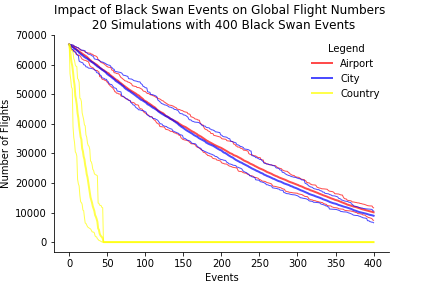
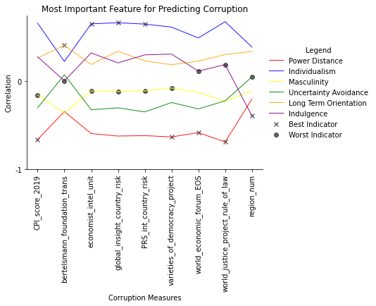
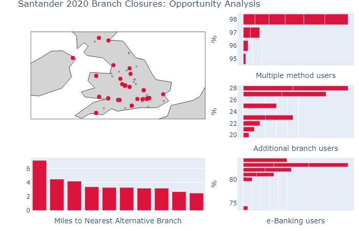

# Mark Thorp's Data Science Portfolio
Frankfurt am Main, Germany

A sample of my projects and qualifications relating to Data Science.

## About me

I have an international business and finance related Bachelors, with a focus on resolving novel problems independently and advising non-specialists on a variety of technical subjects. I have a strong interest in business, culture and finance and have sought to express that through my projects. I have completed The University of Michigan's Python for Everybody Course and Applied Data Science with Python, giving me a solid grounding in Python and SQL (SQLite) and in areas such as AI (regression/classification), web scraping, data cleaning, AB testing and others. Please view my qualifications below for more information or contact me on [Linkedin](https://www.linkedin.com/in/thorpmark/) for more information.

[Tableau profile](https://public.tableau.com/profile/mark.thorp8511)

## Projects

### Simple Selenium web scraper

[Overview](https://mthorp363.github.io/voucher_scraper/]

[Jupyter Notebook](https://github.com/mthorp363/voucher_scraper/blob/main/Udemy%20Freebies%20scraper.ipynb)

This is a simple example of web scraping using the selenium library for Chrome. The aim of this notebook is to harvest URLs for course coupons from [this website](https://www.udemyfreebies.com/) which have may appeared over the last few days. 

### Monte Carlo Airports
September 2020

[Executive Summary](https://mthorp363.github.io/monte_carlo_airports/)

[Jupyter Notebook](https://github.com/mthorp363/monte_carlo_airports/blob/master/Main.ipynb)

Insights from a Black Swan Event Monte Carlo Simulation on International Flight Numbers.

Language(s): Python

Key libraries: Networkx, pandas, matplotlib

### Hofstede's 6 Dimensions and Corruption (part1)
September 2020

[Executive Summary](https://mthorp363.github.io/culture_and_corruption/)

[Jupyter Notebook](https://github.com/mthorp363/culture_and_corruption/blob/master/Main.ipynb)

An analysis of the correlation between corruption ratings and cultural dimensions for feature selection.

Language(s): Python

Key libraries: Pandas, matplotlib, missingno

### Visualising Santander's 2020 Branch Closures
September 2020

[Executive Summary](https://mthorp363.github.io/santander_branch_closures/) 

[Jupyter Notebook](https://github.com/mthorp363/santander_branch_closures/blob/master/Main.ipynb)

An interactive visualisation of Santander's 2020 branch closures.

Language(s): Python

Key libraries: Regex, plotly, ipywidgets

## Projects in development

Pricing tool for tablets based on information scraped from eBay

CV ranker using keywords

Hofstede's 6 Dimensions and Corruption (part2): Linear regression predictor from scratch

## Qualifications

### [Applied Data Science with Python Specialisation](https://www.coursera.org/account/accomplishments/specialization/9FJE8W2RKRFS)
University of Michigan (August 2020)

This course covered a wide range of different areas within data science including ethics, t-testing and AI.

For more information, [click here](https://www.coursera.org/specializations/data-science-python)

Courses:

Introduction to Data Science in Python - Applied Plotting, Charting & Data Representation in Python - Applied Machine Learning in Python - Applied Text Mining in Python - Applied Social Network Analysis in Python

Skills:

Python Programming - Text Mining - Pandas - Matplotlib - Numpy - Data Cleansing - Machine Learning - Scikit-Learn - Natural Language Toolkit (NLTK)

### [Python for Everybody Specialisation](https://www.coursera.org/account/accomplishments/specialization/CYF7KJENMFGZ) 
University of Michigan (April 2020)

This specialisation covered a broad range of different computer science and data science topics such as working with APIs, relational databases and integrating python with other languages (SQL/Javascript/HTML).

For more information, [click here](https://www.coursera.org/specializations/python?skipBrowseRedirect=true)

Courses: 

Programming for Everybody (Getting Started with Python) - Using Databases with Python - Python Data Structures - Using Python to Access Web Data - Capstone: Retrieving, Processing, and Visualizing Data with Python

Skills:

Python Programming - Json - Xml - Database (DBMS) - Data Structures - Web Scraping - Sqlite - SQL

