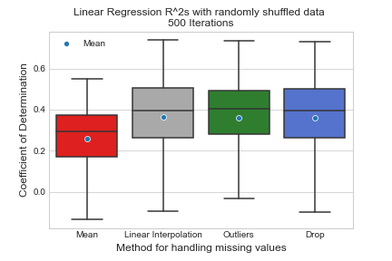

# Mark Thorp's Analysis Portfolio
Oxford, UK

A sample of my projects and qualifications relating to analysis.

## About me

I am an analyst with experience of working in an Agile environment with a track record of business improvement through the creation of management tools, Power BI dashboards and automations through their entire lifecycle, including documentation. I have a BCS (Hons) with a focus on business and finance and am currently completing the International Diploma in Business Analysis. I have completed courses and independant projects using Python, SQL and Excel in areas such as AI (regression/classification), web scraping, data cleaning, AB testing and others. Please view my qualifications below for more information or contact me on [Linkedin](https://www.linkedin.com/in/thorpmark/) for more information.

[Tableau profile](https://public.tableau.com/profile/mark.thorp8511)

## Projects

### Simple Selenium web scraper
December 2020

[Overview](https://mthorp363.github.io/voucher_scraper/)

[Jupyter Notebook](https://github.com/mthorp363/voucher_scraper/blob/main/Udemy%20Freebies%20scraper.ipynb)

This is a simple example of web scraping using the selenium library for Chrome. The aim of this notebook is to harvest URLs for course coupons from [this website](https://www.udemyfreebies.com/) which have may appeared over the last few days. 

### Monte Carlo Airports
September 2020

[Executive Summary](https://mthorp363.github.io/monte_carlo_airports/)

[Jupyter Notebook](https://github.com/mthorp363/monte_carlo_airports/blob/master/Main.ipynb)

Insights from a Black Swan Event Monte Carlo Simulation on International Flight Numbers.

Language(s): Python

Key libraries: Networkx, pandas, matplotlib

### Hofstede's 6 Dimensions and Corruption (part1 & 2)
Part 1: September 2020

Part 2: December 2020

[Executive Summary](https://mthorp363.github.io/culture_and_corruption/)

[Part 1 Jupyter Notebook](https://github.com/mthorp363/culture_and_corruption/blob/master/Main.ipynb)

[Part 2 Jupyter Notebook](https://github.com/mthorp363/culture_and_corruption/blob/master/Part%202.ipynb)

Part 1: An analysis of the correlation between corruption ratings and cultural dimensions for feature selection.

Part2: A linear regression explainer and analysis of the impact of handling missing values

Language(s): Python

Key libraries: Pandas, matplotlib, missingno, sklearn

### Visualising Santander's 2020 Branch Closures
September 2020

[Executive Summary](https://mthorp363.github.io/santander_branch_closures/) 

[Jupyter Notebook](https://github.com/mthorp363/santander_branch_closures/blob/master/Main.ipynb)

An interactive visualisation of Santander's 2020 branch closures.

Language(s): Python

Key libraries: Regex, plotly, ipywidgets

## Projects in development

Pricing tool for tablets based on information scraped from eBay

CV ranker using keywords

## Qualifications

### [Excel Skills for Business](https://www.coursera.org/account/accomplishments/specialization/certificate/ES3DBWKGGDKG)
Macquarie University (March 2021)

This course included the following:

- Design of sophisticated spreadsheets, including professional dashboards, and perform complex calculations using advanced Excel features and techniques. 
- Management of large datasets, extraction of meaningful information from datasets, presentation of data and effective information extraction. 
- Data validation and error prevention, automation (basic Macros), application of advanced formulas and conditional logic to help make decisions and create spreadsheets that help forecast and model data.

For more information, [click here](https://www.coursera.org/specializations/excel)

### [Databases: Relational Databases and SQL](https://courses.edx.org/certificates/318924e4ed264dbbaa9ae6bc38479fbc)
Stanford University (December 2020)

This course covered various types of SQL (PostGres, MySQL and SQLite).

- Introduction to the relational model and concepts in relational databases and relational database management systems
- Comprehensive coverage of SQL, the long-accepted standard query language for relational database management systems

For more information, [click here](https://www.edx.org/course/databases-5-sql)

### [Applied Data Science with Python Specialisation](https://www.coursera.org/account/accomplishments/specialization/9FJE8W2RKRFS)
University of Michigan (August 2020)

This specialisation covered a wide range of different areas within data science including ethics, t-testing and AI.

For more information, [click here](https://www.coursera.org/specializations/data-science-python)

Courses:

Introduction to Data Science in Python - Applied Plotting, Charting & Data Representation in Python - Applied Machine Learning in Python - Applied Text Mining in Python - Applied Social Network Analysis in Python

Skills:

Python Programming - Text Mining - Pandas - Matplotlib - Numpy - Data Cleansing - Machine Learning - Scikit-Learn - Natural Language Toolkit (NLTK)

### [Python for Everybody Specialisation](https://www.coursera.org/account/accomplishments/specialization/CYF7KJENMFGZ) 
University of Michigan (April 2020)

This specialisation covered a broad range of different computer science and data science topics such as working with APIs, relational databases and integrating python with other languages (SQL/Javascript/HTML).

For more information, [click here](https://www.coursera.org/specializations/python?skipBrowseRedirect=true)

Courses: 

Programming for Everybody (Getting Started with Python) - Using Databases with Python - Python Data Structures - Using Python to Access Web Data - Capstone: Retrieving, Processing, and Visualizing Data with Python

Skills:

Python Programming - Json - Xml - Database (DBMS) - Data Structures - Web Scraping - Sqlite - SQL

